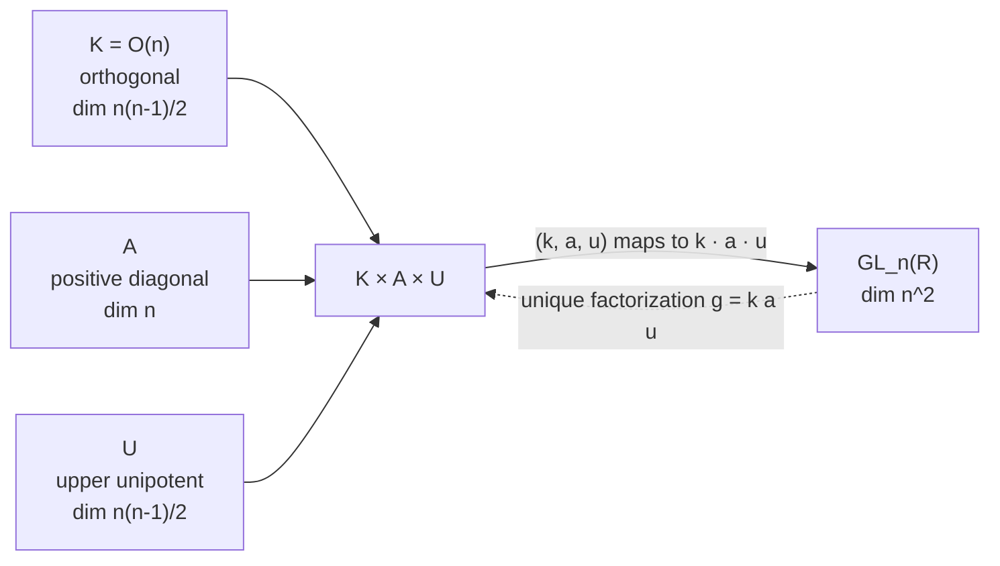
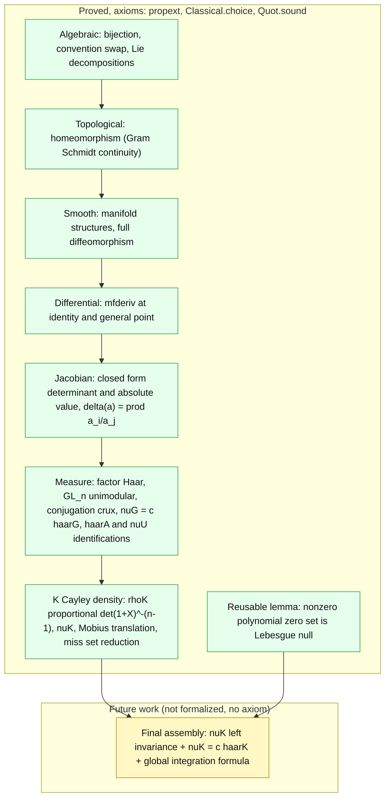
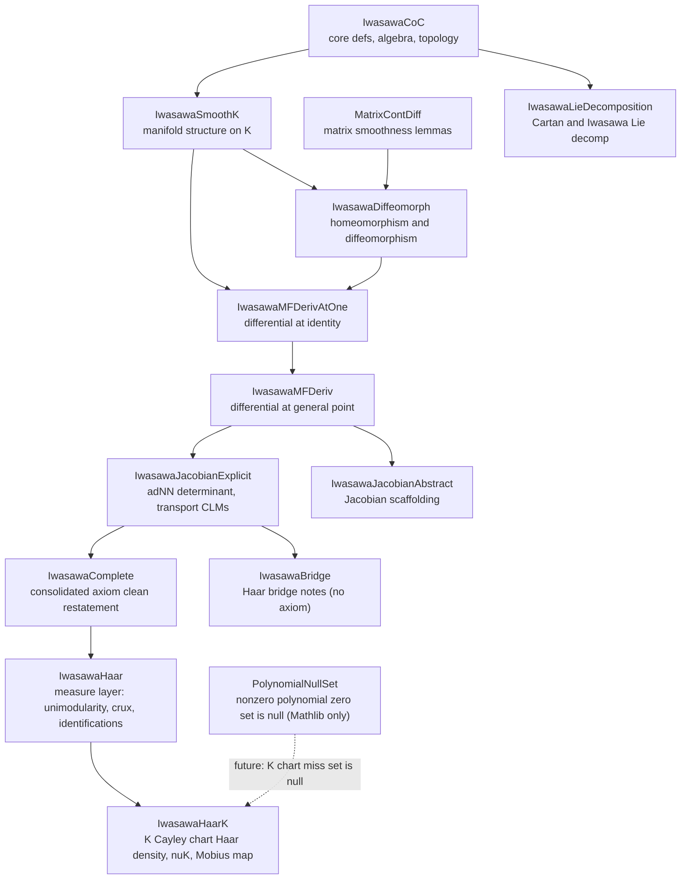

# Iwasawa Decomposition and Change of Coordinates

A Lean 4 / Mathlib formalization of **Theorem 1.1** of

> J. Jorgenson, S. Lang. *Spherical Inversion on* $`SL_n(\mathbb{R})`$.
> Springer Monographs in Mathematics, 2001.

The Iwasawa product map

```math
\Phi : K \times A \times U \to GL_n(\mathbb{R}), \qquad (k, a, u) \mapsto k \cdot a \cdot u
```

is asserted by Jorgenson and Lang to be a *differential isomorphism*
(diffeomorphism), where

- $`K = O(n)`$ is the real orthogonal group,
- $`A`$ is the group of positive diagonal $`n \times n`$ real matrices,
- $`U`$ is the group of unipotent upper triangular $`n \times n`$ real matrices.

This project formalizes the algebraic, topological, and smooth
content of that theorem, building on top of the parent project's
[`project.Iwasawa`](../project/Iwasawa.lean), which provides the
set theoretic existence and uniqueness of the Iwasawa factorization
following Lang's *Linear Algebra*.

The product map and its three factors (the differential isomorphism this
project formalizes):



## Status at a glance

| Quantity | Value |
|---|---|
| Build status | `lake build` succeeds |
| Active Lean `sorry` declarations in `iwasawa_change_of_coords/` | 0 |
| Core algebraic, topological, smooth, and Jacobian axioms | `propext`, `Classical.choice`, `Quot.sound` only |
| User axioms beyond the standard three | 0 (the former Haar placeholder axiom was redundant and has been removed) |

Every layer below is proved with no `sorry` and prints only the standard axioms
`[propext, Classical.choice, Quot.sound]`; there is no user declared axiom anywhere
in the subtree, and `IwasawaComplete.lean` restates every main result with a clean
signature next to its axiom check. The one piece not yet formalized is the final
assembly of the integration formula (the left invariance and Haar uniqueness of the
`K = O(n)` measure, and the global change of variables), described under
[Remaining Work](#remaining-work). It is future work and is not backed by any
placeholder axiom.

Layered status (green is proved with the standard three axioms; yellow is the
final assembly that is future work, not yet formalized):



## Provenance and convention

The parent project follows Lang's *Linear Algebra* (3rd edition, 1987)
and writes the Iwasawa decomposition as $`g = k \cdot a \cdot u`$ (orthogonal,
positive diagonal, upper unipotent, with $`K`$ on the *left*).

Jorgenson and Lang use the opposite order $`g = u \cdot a \cdot k`$ ($`K`$ on the
*right*). The clean change of coordinates between the two conventions
is **inversion**: if $`g = k \cdot a \cdot u`$ (Lang), then

```math
g^{-1} = u^{-1} \cdot a^{-1} \cdot k^{T}
```

is in the Jorgenson and Lang form (upper unipotent, then positive diagonal,
then orthogonal),
since the inverse of an upper unipotent matrix is upper unipotent, the
inverse of a positive diagonal matrix is positive diagonal, and the
transpose of an orthogonal matrix is orthogonal.

The Cartan involution $`\theta : g \mapsto (g^T)^{-1}`$ is a separate involution that
Jorgenson and Lang use on p. 2 to characterize $`K`$ as its fixed point subgroup. We
formalize both.

## Mathematical motivation

The Iwasawa decomposition `g = k · a · u` writes every invertible real matrix
uniquely as an orthogonal factor, a positive diagonal factor, and an upper
unipotent factor, so the product map `Φ : K × A × U → GL_n(ℝ)` is a global
coordinate system on `GL_n(ℝ)`. Calling it a change of coordinates, rather than a
bare bijection, is the assertion that `Φ` is a diffeomorphism: the coordinates and
their inverse are both smooth, so derivatives, vector fields, and integrals all
transform correctly.

The bridge to harmonic analysis is the Jacobian. The determinant of the
differential of `Φ` is the positive root product `δ(a) = ∏_{i<j} aᵢ/aⱼ`, which is
also the factor by which conjugation by `a` scales Haar measure on the unipotent
part. It is exactly the weight in the Haar decomposition
`∫_G f dx = c · ∫∫∫ f(uak) · δ(a)⁻¹ du da dk`. This project formalizes the
algebraic, topological, smooth, and Jacobian content of that statement, together
with most of the measure theory layer.

The full writeup is in [`docs/mathematics.md`](docs/mathematics.md).

## Detailed documentation

The detail lives in [`docs/`](docs) so this page stays small enough for GitHub to
render its math and diagrams:

- [`docs/mathematics.md`](docs/mathematics.md): the motivation in full, the
  fourteen formalized pieces, and the Haar measure layer.
- [`docs/theorem-statements.md`](docs/theorem-statements.md): the Lean signature of
  every main result.
- [`docs/methodology.md`](docs/methodology.md): how the proofs are trusted, the
  de Bruijn criterion, and what `#print axioms` certifies.
- [`docs/proof-outlines.md`](docs/proof-outlines.md): the proof sketch for each
  milestone.

These documents are long and dense with math, so GitHub may display them as source
rather than rendering every formula. The research and planning notes
(`RouteAssessment.md`, `IwasawaBlockers.md`, `KDensityPlan.md`, and the other
`*Plan.md` files) are in the repository root.

## Milestones

All entries below except the final assembly rows (milestone 8) are proved with
no `sorry`, and the diagnostic files print their axiom dependencies as
`[propext, Classical.choice, Quot.sound]`. Milestones 1 through 7, including the
measure theory layer (factor Haar, unimodularity, the conjugation crux, the factor
identifications, the $`K`$ Cayley density, and the polynomial null lemma), are proved
axiom clean. Milestone 8, the final invariance, uniqueness, and integration formula
assembly, is the remaining future work, not yet formalized, and is not backed by any
axiom (see [Remaining Work](#remaining-work)).

| # | Goal | Status | Jorgenson and Lang reference |
|---|------|--------|---------------|
| 1   | `iwasawaEquiv : K × A × U ≃ GL_n(ℝ)` (set-theoretic bijection)                   | Proved   | Thm I.1.1, set-theoretic |
| 1b  | `inv_iwasawa_jl`: $`(kau)^{-1} = u^{-1} a^{-1} k^T`$ (Lang vs Jorgenson and Lang convention swap)            | Proved   | §I.1, p. 2              |
| 1b  | `cartanInvolution`, `cartanInvolution_involutive`                                | Proved   | §I.1, p. 2              |
| 2   | `continuous_iwasawaMap` (forward direction)                                      | Proved   | Thm I.1.1, topology     |
| 2   | `continuous_iwasawaSymm` (inverse direction; Gram-Schmidt continuity from scratch) | Proved | Thm I.1.1, topology     |
| 2   | `iwasawaHomeomorph : K × A × U ≃ₜ GL_n(ℝ)`                                       | Proved   | Thm I.1.1, topology     |
| 3   | `isOpen_G`, `G_isOpenEmbedding`, smooth structure on `G n`                       | Proved   | Thm I.1.1, smoothness   |
| 3   | `UU.toNNHomeomorph`, smooth structure on `UU n` (modeled on `NN n`)              | Proved   | Thm I.1.1, smoothness   |
| 3   | `A.toFinNRHomeomorph`, smooth structure on `A n` (modeled on `Fin n → ℝ`)        | Proved   | Thm I.1.1, smoothness   |
| 3   | Cayley transform setup (`cayley`, `cayleyInv`, `one_add_skew_isUnit`, `cayley_isOrthogonal`) | Proved   | Cayley 1846             |
| 3   | Cayley two-sided inverse (`cayley_self_inverse`, `cayleyInv_cayley`, `cayley_cayleyInv`) | Proved   | Cayley 1846             |
| 3   | `cayleyInv_isSkew` (image of orthogonal under Cayley is skew)                    | Proved   | Cayley 1846             |
| 3   | `cayleyEquiv : Sk n ≃ K_open n` (set-level Cayley bijection)                     | Proved   | Thm I.1.1, smoothness   |
| 3   | Cayley continuity (`continuous_cayley_on_skew`, `continuous_cayleyInv_on_KOpen`) | Proved   | Thm I.1.1, smoothness   |
| 3   | `cayleyHomeomorph : Sk n ≃ₜ K_open n` (topological)                              | Proved   | Thm I.1.1, smoothness   |
| 3   | Smooth manifold structure on `K_open n` modeled on `Sk n` via Cayley chart       | Proved   | Thm I.1.1, smoothness   |
| 3   | `cayleyDiffeomorph : Sk n ≃ₘ K_open n` ($`C^\infty`$ diffeomorphism)                     | Proved   | Thm I.1.1, smoothness   |
| 3   | `IsOrthogonal.mul`, `K_open_at`, `cayleyEquivAt Q₀ : Sk n ≃ K_open_at Q₀`        | Proved   | Thm I.1.1, multi-chart  |
| 3   | `self_mem_K_open_at` (cover $`\bigcup K_{\mathrm{open\,at}} Q = K\,n`$)                                | Proved   | Thm I.1.1, multi-chart  |
| 3   | `cayleyOpenChartAt Q₀ : OpenPartialHomeomorph (K n) (Sk n)` plus `instChartedSpaceK` | Proved   | Sphere-pattern atlas    |
| 3   | `instIsManifoldK` (chart transitions `ContDiffOn`, full `IsManifold` on $`K = O(n)`$) | Proved   | Thm I.1.1, full         |
| 3   | `iwasawaDiffeomorph : K × A × U ≃ₘ GL_n(ℝ)` (full diffeomorphism)                | Proved   | Thm I.1.1, full         |
| 4   | `cartanLieDecomp : IsCompl (Sym n) (Sk n)` (Cartan Lie decomp $`\mathfrak{gl}_n = \mathrm{Sym} \oplus \mathrm{Sk}`$) | Proved   | §I.3, p. 12             |
| 5   | `disjoint_AA_NN`, `disjoint_KK_AA`, `disjoint_KK_NN` (pairwise disjoint)         | Proved   | §I.3                    |
| 5   | `iwasawa_codisjoint`: $`\mathfrak{k} \sqcup \mathfrak{a} \sqcup \mathfrak{n} = \top`$ (sum is everything)                         | Proved   | §I.3                    |
| 5   | `iwasawaLieDecomp`: full Iwasawa Lie decomposition $`\mathfrak{gl}_n = \mathfrak{k} \oplus \mathfrak{a} \oplus \mathfrak{n}`$            | Proved   | §I.3                    |
| 5   | `iwasawaLieEquiv`: linear iso $`\mathfrak{k} \times \mathfrak{a} \times \mathfrak{n} \simeq_{\mathbb{R}} \mathfrak{gl}_n(\mathbb{R})`$ (algebraic differential at 1) | Proved | §I.3                    |
| 5   | `iwasawaMfderivAtIdentity` (geometric `mfderiv` at the identity)                 | Proved   | §I.3                    |
| 6   | `iwasawaMfderivAtFactored` (geometric `mfderiv` at a general $`(k, a, u)`$)        | Proved   | §I.2-I.3                |
| 6   | `det_sandwichOnSkCLM`: Sylvester-Franke $`\det(\Lambda^2 B) = (\det B)^{n-1}`$ on $`\mathrm{Sk}\,n`$ | Proved   | Jacobian density        |
| 6   | `adNN_det_eq_pair_product`: $`\det(\mathrm{ad}_{\mathfrak{n}}\, a) = \prod_{i \lt j} a_i / a_j`$ | Proved   | §I.2, Eq. (3)           |
| 6   | `detInIwasawaBases_fderiv_iwasawaCharted_general` (signed Jacobian determinant)  | Proved   | §I.2 Jacobian           |
| 6   | `absDetInIwasawaBases_fderiv_iwasawaCharted_general` (absolute Jacobian determinant) | Proved | §I.2 Jacobian           |
| 7   | `modularCharacterFun_eq_one`: $`GL_n(\mathbb{R})`$ is unimodular ($`\Delta_G \equiv 1`$)          | Proved   | §I.2, Haar              |
| 7   | `map_conjAut_haarN`: conjugation crux, $`\mathrm{Ad}(a)`$ scales $`\mathrm{haar}_N`$ by $`\delta(a)`$ | Proved | §I.2, Eq. (1)-(3) |
| 7   | `nuG_eq_haarScalarFactor_smul_haarG`: coordinate Haar $`\nu_G = c\,\mathrm{haar}_G`$              | Proved   | §I.2, Haar              |
| 7   | `haarAExplicit_eq_..._haarA`, `nuU_eq_..._haarN`: explicit factor Haar identifications          | Proved   | §I.2, Haar              |
| 7   | `det_cayleyDerivOnSk`: $`K`$ chart Jacobian $`(-2)^{\binom n 2}(\det(1+X))^{-(n-1)}`$, density `rhoK` | Proved | Cayley density       |
| 7   | `nuK`, `cayleyLeftTrans`, `cayley_cayleyLeftTrans`, `mem_cayleyLeftDom_iff` ($`K`$ chart Haar, Mobius map, miss set) | Proved | §I.2, Haar |
| 7   | `volume_setOf_eval_eq_zero`: nonzero polynomial zero set is Lebesgue null (reusable, absent from Mathlib) | Proved | measure theory   |
| 8   | $`\nu_K`$ left invariance, $`\nu_K = c\,\mathrm{haar}_K`$, global integration formula              | Future work (not formalized, no axiom) | §I.2, Prop. 2.1-2.4 |

## Repository layout

```
iwasawa_change_of_coords/
├── README.md                    this file
├── IwasawaCoC.lean              core definitions, algebraic and topological layer
├── MatrixContDiff.lean          smoothness lemmas for matrix operations
├── IwasawaSmoothK.lean          full smooth manifold structure on K = O(n)
├── IwasawaDiffeomorph.lean      homeomorphism and full diffeomorphism
├── IwasawaLieDecomposition.lean Cartan and Iwasawa Lie decompositions
├── IwasawaMFDerivAtOne.lean     manifold differential at the identity
├── IwasawaMFDeriv.lean          manifold differential at a general point
├── IwasawaJacobianAbstract.lean abstract Jacobian / determinant scaffolding
├── IwasawaJacobianExplicit.lean explicit Jacobian: adNN determinant, transport CLMs
├── IwasawaComplete.lean         consolidated axiom-clean restatement,
│                                Sylvester-Franke identity, general-point Jacobian
├── IwasawaBridge.lean           Haar bridge: positive root product, future work notes (no axiom)
├── IwasawaHaar.lean             measure layer: factor Haar, GL_n unimodularity, the
│                                conjugation crux, coordinate Haar nuG = c haarG, and the
│                                haarA and nuU factor identifications
├── IwasawaHaarK.lean            K = O(n) Cayley chart Haar: density rhoK with pinned
│                                exponent (det_cayleyDerivOnSk), candidate measure nuK,
│                                Mobius left translation, chart miss set reduction
├── PolynomialNullSet.lean       reusable: nonzero polynomial zero set is Lebesgue null
└── AxiomCheck*.lean             diagnostic files for axiom dependencies
```

Internal module dependencies (an arrow from A to B means B imports A):



The project shares the parent's Lake build (single `lakefile.toml`,
single `lean-toolchain`, single Mathlib pin), so there is no duplicated
toolchain configuration.

## Build instructions

From the workspace root (the directory containing `lakefile.toml`):

```sh
lake build
lake build iwasawa_change_of_coords.AxiomCheckDiffeomorph
lake build iwasawa_change_of_coords.AxiomCheckMFDerivAtOne
```

The first build will compile the parent project's `project.Iwasawa`
as a dependency.

## Verifying the result

After a successful build, the diagnostic files and the `#print axioms`
blocks at the end of `IwasawaComplete.lean` print axiom dependencies. The
consolidated file checks, among others,

```lean
IwasawaCoC.Complete.iwasawaDiffeo
IwasawaCoC.Complete.iwasawaMfderivAtIdentity
IwasawaCoC.Complete.iwasawaMfderivAtFactored
IwasawaCoC.Complete.det_sandwichOnSkCLM
IwasawaCoC.Complete.detInIwasawaBases_fderiv_iwasawaCharted_general
IwasawaCoC.Complete.absDetInIwasawaBases_fderiv_iwasawaCharted_general
IwasawaCoC.Complete.modularCharacterFun_eq_one              -- GL_n unimodular
IwasawaCoC.Complete.nuG_eq_haarScalarFactor_smul_haarG      -- nuG = c haarG
IwasawaCoC.Complete.det_cayleyDerivOnSk                     -- K chart Jacobian pin
MvPolynomial.volume_setOf_eval_eq_zero                      -- polynomial null lemma
```

each of which reports only `[propext, Classical.choice, Quot.sound]`. The
core namespace is `IwasawaCoC`, and the consolidated restatements live in
`IwasawaCoC.Complete`. `IwasawaBridge.lean` likewise ends with a `#print
axioms` block confirming that it too is axiom free. `IwasawaHaar.lean`,
`IwasawaHaarK.lean`, and `PolynomialNullSet.lean` each end with `#print axioms`
blocks over every named result; all report the same three axioms.
`IwasawaComplete.lean` also contains compile-time
sanity checks: the scalar value $`\det(\mathrm{sandwich}(c \cdot 1)) = c^{\,n(n-1)}`$
at $`n = 3`$, the edge cases $`n = 0`$ and $`n = 1`$, the consistency of the
general Jacobian at $`X = 0`$ with the chart-center value, and (in `IwasawaHaarK.lean`)
the $`SO(2)`$ density check $`2 / (1 + a^2)`$.

## Remaining Work

The Jacobian determinant layer is complete (closed form at a general point,
signed and absolute), and the measure theory layer is now largely formalized:
the factor Haar measures, the unimodularity of $`GL_n(\mathbb{R})`$, the conjugation
crux, the coordinate Haar identification $`\nu_G = c\cdot\mathrm{haar}_G`$, the explicit
factor identifications on $`A`$ and $`U`$, the $`K = O(n)`$ Cayley chart density
$`\rho_K`$ with its pinned exponent, the candidate measure $`\nu_K`$, the Mobius left
translation, and the reusable polynomial null lemma are all proved axiom clean.

What remains is the **final assembly** of the integration formula, in four steps:

1. **Left invariance of $`\nu_K`$ under $`SO(n)`$.** Prove
   $`(\,k_0 \cdot\,)_{*}\,\nu_K = \nu_K`$ for $`k_0`$ in the identity component, by a
   change of variables for the Mobius map $`\Psi_{k_0}`$. The pieces in place are the
   intertwining identity `cayley_cayleyLeftTrans`, the chart domain openness and
   continuity, and the reduction of the chart miss set to a polynomial zero locus
   (`mem_cayleyLeftDom_iff`). The remaining work is: (a) the density transformation
   $`\rho_K(\Psi X)\,|\det D\Psi_X| = \rho_K(X)`$, whose Jacobian factors through the
   same `sandwichOnSkCLM` determinant as `det_cayleyDerivOnSk`; (b) applying
   `volume_setOf_eval_eq_zero` to the `skBasis` coordinates to conclude the miss set
   is $`\nu_K`$ null; and (c) assembling the Mathlib change of variables on the open
   dense chart domain.
2. **The second $`O(n)`$ component.** One Cayley chart covers $`SO(n)`$ only
   (`det_cayley_skew` forces $`\det = +1`$); extend $`\nu_K`$ to the $`\det = -1`$
   coset by a reflected copy.
3. **Haar uniqueness.** Conclude $`\nu_K = c\cdot\mathrm{haar}_K`$ once $`\nu_K`$ is
   established as a Haar measure ($`K`$ is compact, so inner regularity is free).
4. **The product change of variables.** Combine the pointwise absolute Jacobian
   (`absDetInIwasawaBases_fderiv_iwasawaCharted_general`) with the four factor
   identifications and a Mathlib change of variables theorem to obtain the
   pushforward of the product Haar measure under the Iwasawa map, recovering the
   integration formula.

The target integration formula is

```math
\int_G f\,dx = c \int_U \int_A \int_K f(uak)\, \delta(a)^{-1}\, du\, da\, dk.
```

The whole project, including every file above, reduces to
`[propext, Classical.choice, Quot.sound]`: there is no placeholder axiom anywhere
(an earlier Haar "bridge" axiom was found redundant and removed). The four steps
above are genuine future work, not yet formalized, and are not backed by any axiom.
The route, the available Mathlib API, and the precise status against each sub step
are tracked in `RouteAssessment.md`.

## References

- J. Jorgenson, S. Lang. *Spherical Inversion on* $`SL_n(\mathbb{R})`$. Springer
  Monographs in Mathematics, 2001. (Primary source, Chapter I, §1 to §3.)
- S. Lang. *Linear Algebra*, 3rd edition. Springer Undergraduate Texts
  in Mathematics, 1987. (Convention for the parent project.)
- A. Cayley. "Sur quelques propriétés des déterminants gauches."
  *Crelle's Journal* 32 (1846), 119 to 123.
- The Mathlib community.
  [Mathlib4](https://github.com/leanprover-community/mathlib4).
- H. Macbeth. [`Mathlib.Geometry.Manifold.Instances.Sphere`](https://leanprover-community.github.io/mathlib4_docs/Mathlib/Geometry/Manifold/Instances/Sphere.html), 2021.
  (Stereographic projection multi chart atlas, the model we follow
  for `cayleyOpenChartAt`.)
- [`Mathlib.LinearAlgebra.Matrix.NonsingularInverse`](https://leanprover-community.github.io/mathlib4_docs/Mathlib/LinearAlgebra/Matrix/NonsingularInverse.html): transpose and inverse interaction.
- [`Mathlib.LinearAlgebra.Matrix.PosDef`](https://leanprover-community.github.io/mathlib4_docs/Mathlib/LinearAlgebra/Matrix/PosDef.html): `PosDef.add_posSemidef`, `PosDef.isUnit`, `posSemidef_self_mul_conjTranspose` (used in `one_add_skew_isUnit`).
- [`Mathlib.Analysis.Matrix.Normed`](https://leanprover-community.github.io/mathlib4_docs/Mathlib/Analysis/Matrix/Normed.html): locally attributed matrix norm.
- [`Mathlib.Topology.Instances.Matrix`](https://leanprover-community.github.io/mathlib4_docs/Mathlib/Topology/Instances/Matrix.html): continuity of matrix operations, including `continuousAt_matrix_inv` (used in `continuous_cayley_on_skew` and `continuous_cayleyInv_on_KOpen`).
- [`Mathlib.Geometry.Manifold.IsManifold.Basic`](https://leanprover-community.github.io/mathlib4_docs/Mathlib/Geometry/Manifold/IsManifold.Basic.html): `IsOpenEmbedding.isManifold_singleton`, `isManifold_of_contDiffOn`.
- [`Mathlib.Geometry.Manifold.Diffeomorph`](https://leanprover-community.github.io/mathlib4_docs/Mathlib/Geometry/Manifold/Diffeomorph.html): `Diffeomorph` structure.
- [`Mathlib.MeasureTheory.Measure.Haar.Basic`](https://leanprover-community.github.io/mathlib4_docs/Mathlib/MeasureTheory/Measure/Haar/Basic.html) and `Mathlib.MeasureTheory.Measure.Haar.Unique`: canonical Haar measure `Measure.haar`, `haarScalarFactor`, and Haar uniqueness `isMulLeftInvariant_eq_smul_of_innerRegular` (the factor identifications $`\nu_G = c\,\mathrm{haar}_G`$, $`\mathrm{haar}_A^{\exp}`$, $`\nu_U`$).
- `Mathlib.MeasureTheory.Group.ModularCharacter`: the modular character $`\Delta`$ (`modularCharacterFun`), used for `modularCharacterFun_eq_one`.
- [`Mathlib.MeasureTheory.Measure.Lebesgue.EqHaar`](https://leanprover-community.github.io/mathlib4_docs/Mathlib/MeasureTheory/Measure/Lebesgue/EqHaar.html) and `Mathlib.MeasureTheory.Measure.Haar.OfBasis`: `Basis.addHaar` (the measure `volSk` on $`\mathrm{Sk}_n`$) and `map_linearMap_addHaar_eq_smul_addHaar` (linear maps scale additive Haar by the absolute determinant, used in the conjugation crux and unimodularity).
- `Mathlib.MeasureTheory.Measure.Prod`: Fubini and the product null criterion `measure_prod_null`, `volume_preserving_piFinSuccAbove`, `measurePreserving_swap` (the assembly of `volume_setOf_eval_eq_zero`).
- `Mathlib.Algebra.MvPolynomial.Equiv`: `finSuccEquiv` and `eval_eq_eval_mv_eval'` (the inductive step of the polynomial null lemma).
- [`Mathlib.Algebra.Polynomial.Roots`](https://leanprover-community.github.io/mathlib4_docs/Mathlib/Algebra/Polynomial/Roots.html): `finite_setOf_isRoot` (a nonzero one variable polynomial has finitely many roots, the finite slices).


## License

Released for educational and academic use.
