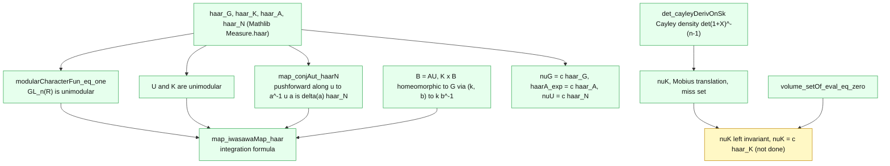

# Mathematical detail

> Detailed reference for the [Iwasawa Decomposition and Change of Coordinates](../README.md) project. This page is long and dense with math, so GitHub may show it as source rather than rendering every formula. The short overview, with rendered status, is in the [README](../README.md).

## Mathematical motivation: why the Iwasawa decomposition is a change of coordinates

### From decomposition to coordinates

$`GL_n(\mathbb{R})`$ is an open subset of the $`n^2`$ dimensional matrix space
$`\mathrm{Mat}_n(\mathbb{R})`$, so as a manifold it is $`n^2`$ dimensional. The three
subgroups in the Iwasawa decomposition contribute exactly the right
dimensions to add up to $`n^2`$:

```math
\dim K = \dim O(n) = \frac{n(n-1)}{2} \quad \text{(skew symmetric matrices)}
```

```math
\dim A = \dim \{\text{positive diagonals}\} = n \quad \text{(one positive real per diagonal entry)}
```

```math
\dim U = \dim \{\text{upper unipotent}\} = \frac{n(n-1)}{2} \quad \text{(strictly upper entries)}
```

```math
\dim K + \dim A + \dim U = \frac{n(n-1)}{2} + n + \frac{n(n-1)}{2} = n^2.
```

The product map

```math
\Phi : K \times A \times U \to GL_n(\mathbb{R}), \qquad \Phi(k, a, u) = k \cdot a \cdot u
```

is therefore a map between two manifolds of equal dimension. The
content of Theorem 1.1 is that $`\Phi`$ is not merely a bijection but a
*differential isomorphism* (diffeomorphism). What this **really
means** is that $`(k, a, u)`$ is a **system of global coordinates**
on $`GL_n(\mathbb{R})`$, or equivalently, that the Iwasawa decomposition
gives a *change of coordinates* from the ambient matrix entries
$`(g_{ij})`$ to the triple $`(k, a, u)`$.

This is more than a curiosity. The Iwasawa coordinates are far
better adapted to the structure of the group than the ambient
entries: $`K`$ carries a compact Lie group structure, $`A`$ is a free
abelian group $`(\mathbb{R}^+)^n`$, and $`U`$ is a unipotent group on which the
exponential map is a *polynomial* diffeomorphism with the Lie
algebra of strictly upper triangular matrices. Many constructions
in representation theory, harmonic analysis on Lie groups, and
spherical function theory either *cannot* or are dramatically
harder to express in the ambient $`(g_{ij})`$ coordinates and become
natural in the Iwasawa coordinates.

### The Jacobian bridge: invariant measure transforms by the Iwasawa character

The classical bridge between "Iwasawa decomposition" and
"change of coordinates Jacobian" is the **Haar measure
decomposition formula**. Let $`dg`$ be Haar measure on $`G = GL_n(\mathbb{R})`$ and
$`dk`$, $`da`$, $`du`$ Haar measures on $`K`$, $`A`$, $`U`$. In Lang's order $`g = kau`$ (the
order used throughout this project),

```math
\int_G f(g)\, dg = c \int_K \int_A \int_U f(kau)\, \delta(a)\, du\, da\, dk ,
```

and in Jorgenson and Lang's order $`g = uak`$ the weight is inverted,

```math
\int_G f(g)\, dg = c \int_U \int_A \int_K f(uak)\, \delta(a)^{-1}\, dk\, da\, du ,
```

for a constant $`c > 0`$ (depending only on how the four Haar measures are normalized)
and the **Iwasawa character**

```math
\delta(a) = \prod_{i \lt j} \frac{a_i}{a_j} = \prod_{i=1}^{n} a_i^{n - 2i + 1} = e^{2\rho(\log a)} .
```

The two forms are equivalent: substitute $`g \mapsto g^{-1}`$, which preserves $`dg`$
because $`GL_n(\mathbb{R})`$ is unimodular, and use $`(kau)^{-1} = u^{-1} a^{-1} k^{-1}`$ with
$`\delta(a^{-1}) = \delta(a)^{-1}`$. Both are proved in `IwasawaIntegration.lean`
(`map_iwasawaMap_haar`, `lintegral_iwasawa`, `map_iwasawaMapJL_haar`); Jorgenson and
Lang treat the Haar measure formula in Chapter I, §2.

Read as a change of variables, the formula says that the Jacobian of
$`(k, a, u) \mapsto kau`$, measured against Haar measure on each side, is $`\delta(a)`$.
$`\delta(a)`$ is the determinant of $`\mathrm{Ad}(a) : X \mapsto a X a^{-1}`$ on the Lie algebra
$`\mathfrak{n} = \mathrm{Lie}(U)`$ of strictly upper triangular matrices: $`\mathrm{Ad}(a)`$ scales the
basis matrix $`E_{ij}`$ ($`i \lt j`$) by $`a_i / a_j`$. This is `adNN_det_eq_pair_product` in
the project. It enters because moving $`a`$ past $`u`$ conjugates $`u`$, and conjugation by
$`a`$ changes Haar measure on $`U`$ by exactly this determinant (`map_conjAut_haarN`).

The project also computes the Jacobian in coordinates. In the Cayley, log and
translation charts, the absolute determinant of the derivative of the Iwasawa map
at a chart point $`(X, v, Z)`$, with $`a = e^{\mathrm{diag}(v)}`$, is
$`2^{n(n-1)/2} (\det a)^n\, \delta(a)\, |\det(1+X)|^{-(n-1)}`$
(`absDetInIwasawaBases_fderiv_iwasawaCharted_general`). This is consistent with the
formula above: $`(\det a)^n = |\det g|^n`$ is cancelled by the density $`|\det g|^{-n}`$ of
Haar measure on $`GL_n(\mathbb{R})`$ against Lebesgue measure on matrix entries,
$`2^{n(n-1)/2} |\det(1+X)|^{-(n-1)}`$ is the density of Haar measure on $`K`$ in Cayley
coordinates (the chart Jacobian is `det_cayleyDerivOnSk`; that this density is left
invariant is the classical fact whose proof is unfinished in `IwasawaHaarK.lean`), and
Lebesgue measure in the log and translation charts is already Haar measure on $`A`$
and $`U`$. What is left over is $`\delta(a)`$.

The integration formula itself is not proved through this Jacobian, though. The proof
in `IwasawaIntegration.lean` uses Haar uniqueness on $`K \times B`$, $`B = AU`$, and needs no
chart on $`K`$; see [section 15](#15-the-integration-formula-iwasawaintegrationlean).

### Why a *differential* isomorphism (not just a bijection)

A bijection just renames points: it lets you say "every $`g`$ has a
unique $`(k, a, u)`$". A homeomorphism additionally guarantees that
the renaming is continuous in both directions: convergence of $`g_n`$
to $`g`$ translates to convergence of $`(k_n, a_n, u_n)`$ to $`(k, a, u)`$.
A *diffeomorphism* additionally guarantees that the renaming is
**smooth in both directions**: derivatives, vector fields, and
integrals all transform correctly under the change of coordinates.

For our purposes, only the diffeomorphism level is strong enough to
support the Haar measure decomposition formula: the Jacobian of a
change of coordinates is the absolute value of the determinant of
the differential of the change, so without a *differential*
isomorphism we cannot even *state* the Jacobian formula. This is
why Theorem 1.1 of Jorgenson and Lang asserts a **differential**
isomorphism, and why our project's central technical content is
the smooth manifold story (the Cayley transform giving a
diffeomorphism $`\mathrm{Sk}\,n \simeq K_{\mathrm{open}}\,n`$, and the Sphere pattern multi chart
atlas covering all of $`K = O(n)`$).

### Connection to the Lie algebra: infinitesimal change of coordinates

Every smooth change of coordinates on a Lie group induces an
**infinitesimal change of coordinates** at the identity, namely a
linear isomorphism between Lie algebras. For the Iwasawa map
$`\Phi : K \times A \times U \to G`$, the differential at the identity
$`(1, 1, 1) \in K \times A \times U`$ is a linear map

```math
d\Phi_{(1,1,1)} : \mathfrak{k} \times \mathfrak{a} \times \mathfrak{n} \to \mathfrak{gl}_n(\mathbb{R}), \qquad (X, Y, Z) \mapsto X + Y + Z
```

where $`\mathfrak{k} = \mathrm{Lie}(K) = \{\text{skew symmetric matrices}\} = \mathrm{Sk}_n`$,
$`\mathfrak{a} = \mathrm{Lie}(A) = \{\text{real diagonal matrices}\}`$, and
$`\mathfrak{n} = \mathrm{Lie}(U) = \{\text{strictly upper triangular matrices}\}`$.

For $`d\Phi_{(1,1,1)}`$ to be a linear isomorphism, the three subspaces
$`\mathfrak{k}, \mathfrak{a}, \mathfrak{n}`$ must form a **direct sum decomposition** of $`\mathfrak{gl}_n(\mathbb{R})`$.
This is the **Iwasawa Lie decomposition**:

```math
\mathfrak{gl}_n(\mathbb{R}) = \mathfrak{k} \oplus \mathfrak{a} \oplus \mathfrak{n}.
```

This is the *purely linear algebraic shadow* of Theorem 1.1, and
has the same dimension count, $`n(n-1)/2 + n + n(n-1)/2 = n^2`$, and
the same role: it expresses every matrix as a sum of a skew, a
diagonal, and a strictly upper triangular piece in a unique way.
The decomposition is also the natural setting for the structure
theory of semisimple Lie algebras (root spaces, parabolic
subalgebras, Borel subalgebras, etc.).

The closely related **Cartan Lie decomposition** is the coarser
splitting

```math
\mathfrak{gl}_n(\mathbb{R}) = \mathrm{Sym}_n \oplus \mathrm{Sk}_n
```

into symmetric and skew symmetric parts. The Iwasawa decomposition
*refines* the symmetric component using the symmetrization of the strictly
upper triangular subalgebra (§I.3, p. 14 of Jorgenson and Lang):

```math
\mathfrak{a} \oplus \mathfrak{n}_{\mathrm{sym}}, \qquad \mathfrak{n}_{\mathrm{sym}} = \tfrac{1}{2}(\mathfrak{n} + \mathfrak{n}^T).
```

In this project we prove both the Iwasawa Lie decomposition
(`iwasawaLieDecomp` and `iwasawaLieEquiv`) and the Cartan Lie
decomposition (`cartanLieDecomp`). The geometric statement that
$`d\Phi_{(1,1,1)}`$ is the linear sum map is the content of
`iwasawaMfderivAtIdentity`, which is now proved. The algebraic
input is that *the candidate linear map* $`(X, Y, Z) \mapsto X + Y + Z`$
is a `LinearEquiv`; the geometric statement follows from the smooth
manifold structure on the full $`K = O(n)`$ together with the first-order
Taylor expansion of the Cayley chart at $`0 \in \mathrm{Sk}`$, namely
$`\mathrm{cayley}(X) = 1 - 2X + O(X^2)`$ (so the Cayley chart contributes a
factor of $`-2`$ on the $`K`$-direction).

## The mathematics formalized in this project

The remainder of this section walks through every theorem,
definition, and instance in the file in mathematical detail, in
the order they appear in `IwasawaCoC.lean`. (See [Theorem
statements](theorem-statements.md) below for the exact Lean
signatures, and [Proof outlines](proof-outlines.md) for the
proof level summaries.)

### 1. The Iwasawa decomposition: $`K \times A \times U \simeq GL_n(\mathbb{R})`$

The starting point. Every invertible real $`n \times n`$ matrix $`g`$ admits
a unique factorization

```math
g = k \cdot a \cdot u, \qquad k \in O(n),\ a \text{ positive diagonal},\ u \text{ upper unipotent}.
```

The proof goes through Gram-Schmidt orthonormalization: write $`g`$'s
columns as a tuple of vectors $`(v_1, \ldots, v_n)`$, run the Gram-Schmidt
procedure to produce an orthonormal basis $`(e_1', \ldots, e_n')`$ of $`\mathbb{R}^n`$,
let $`Q`$ be the matrix of $`e_i'`$ (orthogonal), and $`R = Q^T g`$ (upper
triangular with positive diagonal). Then $`R = a \cdot u`$ for $`a`$ the
diagonal of $`R`$ and $`u = a^{-1} R`$ upper unipotent. Set $`k = Q`$.

Uniqueness comes from a clever orthogonality argument: an
orthogonal upper triangular matrix with positive diagonal must be
the identity. This existence plus uniqueness is the parent project
[`project.Iwasawa`](../project/Iwasawa.lean), which we wrap as
`iwasawaEquiv : K n × A n × UU n ≃ G n`, encoding the bijection
$`K \times A \times U \simeq GL_n(\mathbb{R})`$.

The mathematical content "Iwasawa decomposition is QR
decomposition" should be appreciated here: in numerical linear
algebra parlance this *is* the QR factorization, and the
Iwasawa coordinate Jacobian formula above is the Jacobian of QR
in disguise.

### 2. Convention swap (Lang vs Jorgenson and Lang) and the Cartan involution

The convention swap is a useful exercise in matrix algebra. Lang
writes $`g = k \cdot a \cdot u`$. Jorgenson and Lang write $`g = u \cdot a \cdot k`$. These are *not*
related by simply re labeling factors of the *same* $`g`$: they are
two different factorizations.

The connection is **inversion**: if $`g = kau`$ in Lang form, then
taking inverses

```math
g^{-1} = u^{-1} \cdot a^{-1} \cdot k^{-1} = u^{-1} \cdot a^{-1} \cdot k^{T}
```

(using $`k^{-1} = k^T`$ for orthogonal $`k`$). The right hand side is in
the Jorgenson and Lang form, since:

* $`u^{-1}`$ is upper unipotent (the inverse of an upper unipotent
  matrix is upper unipotent, an easy proof by induction on $`n`$ or by
  explicitly truncating the geometric series),
* $`a^{-1}`$ is positive diagonal (diagonal entries $`1/a_i \gt 0`$),
* $`k^T`$ is orthogonal ($`k^T \cdot (k^T)^T = k^T k = 1`$).

So **inversion** is the change of coordinates between Lang's $`g`$
and the Jorgenson and Lang $`g^{-1}`$. This is `inv_iwasawa_jl`.

The **Cartan involution** is a *different* operation:

```math
\theta : GL_n(\mathbb{R}) \to GL_n(\mathbb{R}), \qquad \theta(g) = (g^T)^{-1} = (g^{-1})^T.
```

It is an order 2 group automorphism (`cartanInvolution_involutive`).
Jorgenson and Lang use it on p. 2 to characterize the orthogonal subgroup as its
fixed point set:

```math
K = \{ g \in GL_n(\mathbb{R}) \mid \theta(g) = g \} = \{ g \mid (g^T)^{-1} = g \} = \{ g \mid g \cdot g^T = 1 \}
```

which is exactly the orthogonality condition. The Cartan involution
also induces an involution on the Lie algebra $`\mathfrak{gl}_n(\mathbb{R})`$ whose
fixed point set is $`\mathfrak{k} = \mathrm{Sk}_n`$ and whose $`-1`$ eigenspace is $`\mathfrak{p} = \mathrm{Sym}_n`$,
giving the **Cartan Lie decomposition** $`\mathfrak{gl}_n = \mathfrak{k} \oplus \mathfrak{p}`$ of Milestone 4.

### 3. Topology: the Iwasawa map is a homeomorphism

The forward direction of continuity is straightforward: matrix
multiplication $`(k, a, u) \mapsto k \cdot a \cdot u`$ is jointly continuous (a
finite product of bilinear matrix multiplication operations,
each of which is continuous by `Continuous.matrix_mul`), and we
embed the result back into the open subtype $`GL_n(\mathbb{R})`$ via
`Continuous.subtype_mk`. This gives `continuous_iwasawaMap`.

The inverse direction is substantially harder, and is the most
technically interesting topological content of the project. Given
$`g \in GL_n(\mathbb{R})`$, we need to show that the maps $`g \mapsto k`$, $`g \mapsto a`$,
$`g \mapsto u`$ are continuous. Each of these is built from Gram-Schmidt
orthonormalization applied to the columns of $`g`$, so we are
asking: **is Gram-Schmidt continuous in its input function?**

The answer is yes, on the open set of input tuples that are
linearly independent. The intuition: the Gram-Schmidt outputs are
rational functions of the input vectors, with positive denominators
(norms of intermediate vectors) on the linearly independent locus,
so they are continuous (in fact smooth). Concretely, Wikipedia's
"Gram-Schmidt process" article gives an explicit determinantal
formula:

```math
u_j = \frac{1}{D_{j-1}} \det \begin{pmatrix} \langle v_1, v_1 \rangle & \langle v_2, v_1 \rangle & \cdots & \langle v_j, v_1 \rangle \\ \vdots & \vdots & \ddots & \vdots \\ \langle v_1, v_{j-1} \rangle & \cdots & \cdots & \langle v_j, v_{j-1} \rangle \\ v_1 & v_2 & \cdots & v_j \end{pmatrix}
```

where $`D_{j-1}`$ is the Gram determinant of the previous vectors.
Since each entry is a polynomial in the $`v_i`$ and $`D_{j-1} \gt 0`$
on the linearly independent locus, each $`u_j`$ is rational with
non vanishing denominator there, hence continuous.

Mathlib does **not** package this continuity result. We prove it
inline by induction on the index $`i : \mathrm{Fin}\,n`$ using
`gramSchmidt_def`, which expresses

```math
\mathrm{gramSchmidt}(f)(i) = f(i) - \sum_{j \lt i} (\mathbb{R} \cdot \mathrm{gramSchmidt}(f)(j))\text{.starProjection}\,(f(i)).
```

Each term in the sum is continuous in $`f`$ by induction (the
projection onto a 1 dimensional subspace is the rational expression
$`(\langle v, w \rangle / \lVert v \rVert^2) \cdot v`$ via `Submodule.starProjection_singleton`,
which is continuous when $`\lVert v \rVert \ne 0`$, and the previous Gram-Schmidt
outputs are nonzero on the linearly independent locus).

This is the proof of `continuous_gramSchmidt_at`, which feeds into
`continuous_qMat_subtype`, `continuous_dMat_subtype`,
`continuous_uMat_subtype`, and finally `continuous_iwasawaSymm`.
Combining with the forward continuity gives `iwasawaHomeomorph`.
(This continuity result for `gramSchmidt` and `gramSchmidtNormed` is
itself a candidate Mathlib upstream contribution.)

### 4. Smooth structures on the easy three subgroups

The three "easy" subgroups admit single chart smooth structures.

**$`G n = GL_n(\mathbb{R})`$ as an open submanifold of $`\mathrm{Mat}_n(\mathbb{R})`$:** the
determinant map is continuous, so $`\{ g \in \mathrm{Mat}_n(\mathbb{R}) \mid \det g \ne 0 \}`$ is
open in $`\mathrm{Mat}_n(\mathbb{R})`$. Hence $`G n`$ is an open submanifold modeled on
$`\mathrm{Mat}_n(\mathbb{R})`$, with smooth structure provided by Mathlib's
`IsOpenEmbedding.singletonChartedSpace` and
`IsOpenEmbedding.isManifold_singleton`. The norm on $`\mathrm{Mat}_n(\mathbb{R})`$ is
chosen via `attribute [local instance]` as the standard sup of sup
norm `Matrix.normedAddCommGroup` (Mathlib intentionally does not
register a canonical matrix norm globally because several natural
choices exist). This is `instChartedSpaceG`, `instIsManifoldG`.

**$`UU\,n`$ as an affine slice of $`\mathrm{Mat}_n(\mathbb{R})`$:** an upper unipotent
matrix is $`1 + X`$ for $`X`$ strictly upper triangular (i.e.
$`X \in NN\,n = \mathfrak{n}`$), so the natural chart is the *translation*

```math
UU\,n \to NN\,n, \qquad U \mapsto U - 1
```

with inverse $`X \mapsto X + 1`$. Both maps are continuous (subtraction
and addition by a constant matrix), and the bijection is the
homeomorphism `UU.toNNHomeomorph`. The chart's source is all of
$`UU\,n`$, so we can use
`OpenPartialHomeomorph.singletonChartedSpace` to get
`ChartedSpace (NN n) (UU n)` and `IsManifold` modeled on the
normed space $`NN\,n`$ (a `Submodule` of $`\mathrm{Mat}_n(\mathbb{R})`$).

**$`A\,n`$ via diagonal logs:** a positive diagonal matrix is
characterized by its $`n`$ strictly positive diagonal entries; the
homeomorphism

```math
A\,n \to \mathbb{R}^n, \qquad D \mapsto (\log D_{11}, \ldots, \log D_{nn})
```

with inverse $`v \mapsto \mathrm{diag}(\exp v_1, \ldots, \exp v_n)`$ provides a single
chart. The map is well defined because $`D_{ii} \gt 0`$, so $`\log`$ is
continuous, and $`\exp v_i \gt 0`$ for all real $`v_i`$, so the inverse
lands back in $`A\,n`$. This is `A.toFinNRHomeomorph`. Modeled on
$`\mathrm{Fin}\,n \to \mathbb{R}`$ (Pi normed space).

### 5. The Cayley transform: parametrizing $`O(n)`$ by skew symmetric matrices

The hard subgroup is $`K = O(n)`$. Unlike $`G`$, $`A`$, $`UU`$, the
orthogonal group is not a single coordinate chart's worth of
material: it is a **compact closed submanifold** cut out by the
quadratic equations $`Q \cdot Q^T = 1`$. Single charts cannot cover
compact manifolds (the image would be both compact and
homeomorphic to an open subset of a Euclidean space, which is
impossible for compact manifolds of positive dimension).

The standard way around this is the **Cayley transform**, due to
Cayley (1846):

```math
\mathrm{cayley} : \mathrm{Mat}_n(\mathbb{R}) \to \mathrm{Mat}_n(\mathbb{R}), \qquad \mathrm{cayley}(X) = (1 - X)(1 + X)^{-1}.
```

Two crucial facts:

1. **$`(1 + X)`$ is invertible whenever $`X`$ is skew symmetric.** This
   is `one_add_skew_isUnit`. Proof: $`(1 + X)(1 - X) = 1 - X^2`$ and
   since $`X`$ is skew, $`X^2 = -X \cdot X^T`$, so $`1 - X^2 = 1 + X \cdot X^T`$. The
   matrix $`X \cdot X^T`$ is positive semi definite (it is the Gram matrix
   of the rows of $`X`$), so $`1 + X \cdot X^T`$ is positive definite, in
   particular invertible. Taking determinants of $`(1 + X)(1 - X) = 1 + X \cdot X^T`$
   shows $`\det(1 + X)^2 \gt 0`$, so $`\det(1 + X) \ne 0`$.

2. **$`\mathrm{cayley}(X)`$ is orthogonal whenever $`X`$ is skew symmetric.**
   This is `cayley_isOrthogonal`. Proof: a direct computation using
   that $`(1 - X)`$, $`(1 + X)`$ and their inverses all commute (because
   they are polynomials in $`X`$):

```math
\begin{aligned} \mathrm{cayley}(X) \cdot \mathrm{cayley}(X)^T &= (1 - X)(1 + X)^{-1} \cdot ((1 + X)^{-1})^T (1 - X)^T \\ &= (1 - X)(1 + X)^{-1} \cdot (1 + X^T)^{-1}(1 - X^T) \\ &= (1 - X)(1 + X)^{-1} \cdot (1 - X)^{-1}(1 + X) \\ &= (1 - X)(1 - X)^{-1} \cdot (1 + X)^{-1}(1 + X) \\ &= 1. \end{aligned}
```

In words: as $`X`$ ranges over skew symmetric matrices $`\mathrm{Sk}\,n`$, the
formula $`\mathrm{cayley}(X) = (1 - X)(1 + X)^{-1}`$ ranges over orthogonal
matrices $`Q`$ for which $`1 + Q`$ is invertible (i.e., $`-1`$ is not an
eigenvalue of $`Q`$). This is a dense open subset of $`SO(n)`$, called
$`K_{\mathrm{open}}\,n`$ in our file. It lies inside $`SO(n)`$ because an orthogonal
matrix with determinant $`-1`$ always has $`-1`$ as an eigenvalue, so the other
component of $`O(n)`$ needs different charts (next section).

The transform is **its own inverse**: applying $`\mathrm{cayley}`$ twice
returns the input (when both $`1 + X`$ and $`1 + \mathrm{cayley}(X)`$ are
invertible). This is `cayley_self_inverse`, proved by deriving
the algebraic identity

```math
1 - \mathrm{cayley}(X) = X \cdot (1 + \mathrm{cayley}(X))
```

(which holds for any $`X`$ with $`1 + X`$ invertible, and follows from
the two key Cayley identities $`(1 \pm \mathrm{cayley}(X))(1 + X)`$ proved as `one_add_cayley_mul` and
`one_sub_cayley_mul`), then dividing both sides by
$`1 + \mathrm{cayley}(X)`$ (also invertible).

Since `cayley` and `cayleyInv` have *the same formula*
$`(1 - M)(1 + M)^{-1}`$ (one is just the name we give to the function
when going one direction or the other), `cayley_self_inverse`
immediately gives both `cayleyInv ∘ cayley = id` on $`\mathrm{Sk}`$ and
`cayley ∘ cayleyInv = id` on $`K_{\mathrm{open}}`$. Bundling these gives
`cayleyEquiv`, the set theoretic bijection $`\mathrm{Sk}\,n \simeq K_{\mathrm{open}}\,n`$.

For the **continuity** of Cayley, both directions reduce to
continuity of matrix inversion on units, which Mathlib provides
via `continuousAt_matrix_inv` (matrix inverse is continuous at
any non singular matrix) plus `NormedRing.inverse_continuousAt`
(the abstract `Ring.inverse` is continuous at any unit). Bundling
gives `cayleyHomeomorph`, the topological bijection $`\mathrm{Sk}\,n \simeq_t K_{\mathrm{open}}\,n`$.

For the **smoothness** (i.e., $`C^\infty`$ ness), the same matrix inverse
on units lemmas give `ContDiff` smoothness of the underlying
matrix valued formulas; lifting to `ContMDiff` between manifolds
modeled on $`\mathrm{Sk}\,n`$ (with $`K_{\mathrm{open}}\,n`$ modeled via the Cayley chart
itself) is achieved through `contMDiff_isOpenEmbedding` and
`contMDiffOn_isOpenEmbedding_symm` plus a function equality
identification. Bundling all of this gives `cayleyDiffeomorph`, a
$`C^\infty`$ diffeomorphism between the
skew symmetric matrices and the dense open subset $`K_{\mathrm{open}}\,n`$ of $`SO(n)`$.

### 6. The Sphere pattern multi chart atlas covering all of $`K = O(n)`$

Cayley centered at the identity covers $`K_{\mathrm{open}}\,n`$, the open subset
where $`1 + Q`$ is invertible. To cover the rest of $`O(n)`$ we follow
Mathlib's `Sphere.lean` pattern (Heather Macbeth, 2021): put a
Cayley chart **at every point** of $`K`$.

The translated Cayley chart at $`Q_0 \in K`$ is

```math
\mathrm{chart}_{Q_0} : K \to \mathrm{Sk}, \qquad \mathrm{chart}_{Q_0}(Q) = \mathrm{cayleyInv}(Q \cdot Q_0^T),
```

defined on the open subset $`K_{\mathrm{open\,at}}\,Q_0 = \{ Q \in K \mid 1 + Q \cdot Q_0^T \text{ invertible} \}`$. The inverse goes $`X \mapsto \mathrm{cayley}(X) \cdot Q_0`$. This is a
direct generalization of the identity centered chart and reduces to
it via the substitution $`Q' = Q \cdot Q_0^T`$ (which sends $`K_{\mathrm{open\,at}}\,Q_0`$
to $`K_{\mathrm{open}}`$ bijectively). The `cayleyEquivAt` in our file packages
this as $`\mathrm{Sk}\,n \simeq K_{\mathrm{open\,at}}\,Q_0`$.

The crucial covering property: **every $`Q \in K`$ lies in
$`K_{\mathrm{open\,at}}\,Q`$ itself**, because $`Q \cdot Q^T = 1`$ and $`1 + 1 = 2 \cdot 1`$
has determinant $`2^n \ne 0`$. This is `self_mem_K_open_at`. So the
family $`\{ K_{\mathrm{open\,at}}\,Q \mid Q \in K \}`$ is an open cover of $`K`$, and the
chart at $`Q`$ is `cayleyOpenChartAt Q`. Atlas: take all
`cayleyOpenChartAt Q₀` for $`Q_0`$ ranging over $`K`$.

This is `instChartedSpaceK`. The resulting `ChartedSpace (Sk n) (K n)`
gives $`K = O(n)`$ a topological manifold structure modeled on the
skew symmetric matrices. The `IsManifold` instance,
i.e., the smoothness of all chart transition maps, is `instIsManifoldK`,
which is now proved. The transition is

```math
\mathrm{chart}_{Q_1} \circ (\mathrm{chart}_{Q_0})^{-1} : X \in \mathrm{Sk} \mapsto \mathrm{cayleyInv}(\mathrm{cayley}(X) \cdot Q_0 \cdot Q_1^T),
```

defined on the open subset of $`\mathrm{Sk}\,n`$ where $`1 + \mathrm{cayley}(X) \cdot Q_0 \cdot Q_1^T`$
is invertible. This is a composition of three smooth pieces (cayley,
right multiplication by a fixed orthogonal matrix, cayleyInv), and
its smoothness reduces to standard `ContDiff` lemmas about matrix
multiplication and matrix inversion on units, plus
`isManifold_of_contDiffOn` to lift to `IsManifold`.

### 7. The Cartan Lie decomposition $`\mathfrak{gl}_n(\mathbb{R}) = \mathrm{Sym}_n \oplus \mathrm{Sk}_n`$

This is the simplest of the Lie algebra side decompositions and a
classical fact: every real square matrix is the sum of a symmetric
and a skew symmetric matrix in a unique way. The decomposition is

```math
M = \tfrac{1}{2}(M + M^T) + \tfrac{1}{2}(M - M^T),
```

with the symmetric part $`\tfrac{1}{2}(M + M^T) \in \mathrm{Sym}_n`$ and the
skew symmetric part $`\tfrac{1}{2}(M - M^T) \in \mathrm{Sk}_n`$. Uniqueness: if
$`M \in \mathrm{Sym} \cap \mathrm{Sk}`$ then $`M^T = M = -M`$, so $`2M = 0`$, so $`M = 0`$.

In Lean this is `cartanLieDecomp : IsCompl (Sym n) (Sk n)`, where
`IsCompl` is the lattice theoretic statement that $`\mathrm{Sym} \cap \mathrm{Sk} = \bot`$
(the disjoint condition) and $`\mathrm{Sym} \sqcup \mathrm{Sk} = \top`$ (the sum is everything
condition). `Sym` and `Sk` are realized as `Submodule ℝ Mat_n(ℝ)`.

This is exactly the Cartan decomposition in the sense of Lie theory: the
maximal compact subalgebra and its orthogonal complement under the trace form are

```math
\mathrm{Sk}_n = \mathrm{Lie}(O(n)) = \mathfrak{k}, \qquad \mathrm{Sym}_n = \mathfrak{p}.
```

The corresponding Cartan involution on the Lie algebra sends $`M`$ to $`-M^T`$,
with $`+1`$ eigenspace $`\mathfrak{k}`$ and $`-1`$ eigenspace $`\mathfrak{p}`$.

### 8. The Iwasawa Lie decomposition $`\mathfrak{gl}_n(\mathbb{R}) = \mathfrak{k} \oplus \mathfrak{a} \oplus \mathfrak{n}`$

This is the Lie algebra shadow of the Iwasawa group decomposition,
and the most substantial piece of pure linear algebra in the
project. The three subspaces are

```math
\mathfrak{k} = \mathrm{Sk}_n \quad (\text{skew symmetric matrices, } \mathrm{Lie}(O(n)))
```

```math
\mathfrak{a} = AA_n \quad (\text{real diagonal matrices, } \mathrm{Lie}(\text{positive diagonals}))
```

```math
\mathfrak{n} = NN_n \quad (\text{strictly upper triangular matrices, } \mathrm{Lie}(\text{upper unipotent}))
```

with dimensions $`n(n-1)/2 + n + n(n-1)/2 = n^2`$ summing to
$`\dim \mathfrak{gl}_n(\mathbb{R})`$.

We prove the four conditions for an internal direct sum
decomposition:

* `disjoint_AA_NN`: $`\mathfrak{a} \cap \mathfrak{n} = 0`$. A diagonal and strictly upper
  matrix has zero off diagonal entries (by $`\mathfrak{a}`$) and zero diagonal
  entries (by $`\mathfrak{n}`$), so it is the zero matrix.
* `disjoint_KK_AA`: $`\mathfrak{k} \cap \mathfrak{a} = 0`$. A skew diagonal matrix has
  $`M_{ii} = -M_{ii}`$ (skew), so $`M_{ii} = 0`$, and zero off diagonal
  by diagonality.
* `disjoint_KK_NN`: $`\mathfrak{k} \cap \mathfrak{n} = 0`$. Below the diagonal, strict upper
  membership gives $`M_{ij} = 0`$. On and above the diagonal we use
  skew symmetry: at $`(j, i)`$ for $`i \lt j`$ we have $`M_{ji} = 0`$ (below
  diagonal), and skew gives $`M_{ij} = -M_{ji} = 0`$.
* `iwasawa_codisjoint`: $`\mathfrak{k} + \mathfrak{a} + \mathfrak{n} = \mathfrak{gl}_n(\mathbb{R})`$. For any $`M`$, we
  construct the explicit decomposition

```math
A_{ij} = \begin{cases} M_{ii} & \text{if } i = j \\ 0 & \text{otherwise} \end{cases} \quad (\text{diagonal of } M)
```

```math
K_{ij} = \begin{cases} M_{ij} & \text{if } j \lt i \\ -M_{ji} & \text{if } i \lt j \\ 0 & \text{if } i = j \end{cases}
```

```math
N_{ij} = \begin{cases} M_{ij} + M_{ji} & \text{if } i \lt j \\ 0 & \text{otherwise} \end{cases}
```

  and verify $`A + K + N = M`$ on each of the three cases
  ($`j \lt i`$, $`j = i`$, $`i \lt j`$).

These four conditions, combined, give `iwasawaLieDecomp`, the full
internal direct sum statement.

### 9. The algebraic differential at the identity: $`\mathfrak{k} \times \mathfrak{a} \times \mathfrak{n} \simeq \mathfrak{gl}_n`$

The Lie algebra version of "the Iwasawa map is a diffeomorphism"
is "the Lie sum map is a linear isomorphism." We define

```math
\mathrm{iwasawaLieMap} : \mathfrak{k} \times \mathfrak{a} \times \mathfrak{n} \to_{\mathbb{R}} \mathfrak{gl}_n(\mathbb{R}), \qquad (X, Y, Z) \mapsto X + Y + Z
```

and prove:

* `iwasawaLieMap_surjective`: every $`M \in \mathfrak{gl}_n(\mathbb{R})`$ is in the image,
  immediately from `iwasawa_codisjoint`.
* `iwasawaLieMap_injective`: the kernel is trivial. Suppose
  $`X + Y + Z = 0`$ with $`X`$ skew, $`Y`$ diagonal, $`Z`$ strict upper.
  By the entry wise trichotomy:
    * $`j \lt i`$: $`Y_{ij} = 0`$ (off diagonal of a diagonal),
      $`Z_{ij} = 0`$ ($`j \le i`$ triggers strict upper zero), so
      $`X_{ij} = 0`$.
    * $`j = i`$: skew says $`X_{ii} = -X_{ii}`$, so $`X_{ii} = 0`$, and
      similarly the other two are zero on the diagonal.
    * $`i \lt j`$: by the previous case at $`(j, i)`$ we have $`X_{ji} = 0`$;
      skew gives $`X_{ij} = -X_{ji} = 0`$. The remaining $`Y_{ij}`$ and
      $`Z_{ij}`$ are zero by the same arguments as above.
  So $`X = Y = Z = 0`$.
* `iwasawaLieEquiv` bundles these as `LinearEquiv.ofBijective`.

This is the **algebraic differential at the identity** of the
Iwasawa map. The geometric statement `iwasawaMfderivAtIdentity`
identifies `mfderiv (iwasawaMap) (1, 1, 1)` with the corresponding
linear isomorphism, with the Cayley chart's first-order Taylor
expansion contributing a factor of $`-2`$ on the $`K`$-direction; it is
now proved.

This linear isomorphism is the "infinitesimal change of coordinates"
between the ambient Lie algebra $`\mathfrak{gl}_n(\mathbb{R})`$ and the Iwasawa Lie
factor $`\mathfrak{k} \times \mathfrak{a} \times \mathfrak{n}`$. It is the Lie algebra level Jacobian of the
Iwasawa map at the identity, and the inverse map $`M \mapsto (K, A, N)`$
gives the explicit formulas above.

## The Haar measure layer: from the pointwise Jacobian to the invariant measure

The Jacobian milestones produce a *pointwise* density. The Haar layer works with
*measures*: it proves that $`GL_n(\mathbb{R})`$, $`U`$ and $`K`$ are unimodular, how conjugation
acts on Haar measure of $`U`$, and finally the integration formula. This is where the
project crosses from differential topology into measure theory, in
`IwasawaHaar.lean`, `IwasawaIntegration.lean`, `IwasawaHaarK.lean`, and
`PolynomialNullSet.lean`.



The right-hand column (the explicit Cayley density on $`K`$) was the original route to
the integration formula. It is no longer needed for it, and its last steps are not
formalized.

### 10. Abstract Haar measures and the unimodularity of $`GL_n(\mathbb{R})`$

Mathlib supplies a canonical (left) Haar measure on any locally compact second
countable Hausdorff topological group through `MeasureTheory.Measure.haar`, with
an `IsHaarMeasure` instance. We name the four we need
$`\mathrm{haar}_K, \mathrm{haar}_A, \mathrm{haar}_N, \mathrm{haar}_G`$ on $`K, A, U, G`$
(the file calls $`U`$'s Lie group $`\mathrm{haar}_N`$ for "nilpotent"). The product
$`\mathrm{haar}_{KAU} = \mathrm{haar}_K \times \mathrm{haar}_A \times \mathrm{haar}_N`$ on
$`K \times A \times U`$ is again Haar (`haarKAU`, `instIsHaarMeasureHaarKAU`).

A group is **unimodular** when its left Haar measure is also right invariant,
equivalently when its **modular character** $`\Delta : G \to \mathbb{R}^{+}`$ is constant
equal to $`1`$. For $`G = GL_n(\mathbb{R})`$ this is classical, and we prove it as

```math
\texttt{modularCharacterFun\_eq\_one} : \quad \Delta_G \equiv 1 .
```

The proof routes through an explicit *coordinate* Haar measure on $`G`$. Identify
$`G`$ with the open set $`\{\det \ne 0\} \subset \mathrm{Mat}_n(\mathbb{R}) \cong \mathbb{R}^{n^2}`$, and
weight ambient Lebesgue measure by the density $`|\det g|^{-n}`$:

```math
\mathrm{haar}_G^{\mathrm{coord}} = \mathrm{volume}.\mathrm{withDensity}\bigl(g \mapsto |\det g|^{-n}\bigr).
```

Left translation $`g \mapsto g_0 g`$ is a *linear* map on $`\mathrm{Mat}_n(\mathbb{R})`$ with
determinant $`(\det g_0)^{n}`$ (`det_leftMulMatLin`), so by
`Measure.map_linearMap_addHaar_eq_smul_addHaar` it rescales ambient Lebesgue by a
power of $`|\det g_0|`$; the density factor $`|\det g|^{-n}`$ is chosen exactly so
that this rescaling cancels, leaving the coordinate measure left invariant
(`map_leftMulCoord_haarGCoord`). The same computation for right translation
(`map_rightMulCoord_haarGCoord`, determinant $`(\det g_0)^n`$ again) shows the
coordinate measure is **both** left and right invariant, hence $`G`$ is
unimodular. Pulling $`\mathrm{haar}_G^{\mathrm{coord}}`$ back to the subtype $`G`$ gives the
measure $`\nu_G`$ (`nuG`), with `map_leftMul_nuG` and `map_rightMul_nuG`, and the
instances `instIsHaarMeasure_nuG`, `instRegular_nuG`. Haar uniqueness on the
second countable group $`G`$ then yields

```math
\texttt{nuG\_eq\_haarScalarFactor\_smul\_haarG} : \quad \nu_G = c \cdot \mathrm{haar}_G, \qquad c = \mathrm{haarScalarFactor}\,\nu_G\,\mathrm{haar}_G > 0 .
```

### 11. The conjugation crux: $`\mathrm{Ad}(a)`$ scales $`\mathrm{haar}_N`$ by $`\delta(a)`$

The single most load bearing measure identity is how conjugation by a diagonal
$`a \in A`$ acts on Haar measure of the unipotent group $`U`$. Write
$`\mathrm{conj}_a(u) = a^{-1}\,u\,a`$; this is a group automorphism of $`U`$ (`conjAut a`).
The statement is

```math
\texttt{map\_conjAut\_haarN} : \quad (\mathrm{conj}_a)_{*}\,\mathrm{haar}_N = \delta(a)\,\mathrm{haar}_N, \qquad \delta(a) = \det\bigl(\mathrm{Ad}(a)|_{\mathfrak{n}}\bigr) = \prod_{i \lt j} \frac{a_i}{a_j} > 0,
```

matching the Lean statement `map (conjAut a) haarN = (det (adNN a)).toNNReal • haarN`.
The proof transports to the chart $`U \cong NN_n = \mathfrak{n}`$ (strictly upper triangular
matrices) via $`u \mapsto u - 1`$, where conjugation becomes the *linear*
automorphism $`Z \mapsto a^{-1} Z a`$ of $`\mathfrak{n}`$ whose determinant is $`\delta(a)^{-1}`$
(`det_adNN_pos`, `det_conjDiag`). Pushing Lebesgue measure forward along a linear
automorphism multiplies it by the inverse of the absolute determinant, which is where
the factor $`\delta(a)`$ comes from. Pushing the chart Lebesgue measure (the explicit
measure $`\nu_U`$) through a linear automorphism rescales it by that determinant
factor, and the bookkeeping yields exactly $`\delta(a)\,\mathrm{haar}_N`$; the abstract
modular machinery `mulEquivHaarChar_conjAut` packages this as the Haar character of
the automorphism $`\mathrm{conj}_a`$. This $`\delta(a)`$ is the **Iwasawa
character**, the same one that appears in the pointwise Jacobian milestone, and it
is the eventual weight in the integration formula.

### 12. Explicit factor Haar measures and their identifications

On the two flat factors the Haar measure is the pushforward of Lebesgue through
a global chart, and we prove it left invariant directly:

- **$`A`$ (abelian, log chart).** The logarithm chart
  $`A \cong \mathbb{R}^n,\ D \mapsto (\log D_{ii})_i`$ is a group isomorphism from the
  multiplicative group $`A`$ to the additive group $`\mathbb{R}^n`$
  (`toFinNRHomeomorph_mul`). Pushing Lebesgue measure forward through its inverse
  gives the explicit left invariant measure $`\mathrm{haar}_A^{\exp}`$ (`haarAExplicit`,
  `instIsMulLeftInvariantHaarAExplicit`). By Haar uniqueness,
  $`\texttt{haarAExplicit\_eq\_haarScalarFactor\_smul\_haarA} : \mathrm{haar}_A^{\exp} = c\cdot\mathrm{haar}_A`$.

- **$`U`$ (unipotent, entry chart).** Left translation $`u \mapsto u_0 u`$ in the entry
  chart $`U \cong NN_n`$ is the *affine* map $`Z \mapsto u_0 Z + (u_0 - 1)`$ with unit
  linear part (`det_transLin`), so it preserves Lebesgue (`map_transLin_volume`),
  making the pushforward $`\nu_U`$ left invariant (`instIsMulLeftInvariant_nuU`,
  `instIsHaarMeasure_nuU`). Haar uniqueness gives
  $`\texttt{nuU\_eq\_haarScalarFactor\_smul\_haarN} : \nu_U = c\cdot\mathrm{haar}_N`$.

The contrast with $`K = O(n)`$ in the next section is the whole point: $`A`$ and $`U`$
are *flat* groups (their group law linearizes in the chart), so flat Lebesgue is
left invariant; $`O(n)`$ is *curved*, and flat Lebesgue is **not** invariant.

### 13. The $`K = O(n)`$ Cayley chart Haar density (`IwasawaHaarK.lean`)

This was the planned route to the $`K`$ factor of the integration formula (section 15
proves the formula without it) and is the most subtle part of the measure theory. The Cayley chart $`\mathrm{cayleyToK} : \mathrm{Sk}_n \to K_n`$ parametrizes the
dense open subset of $`SO(n)`$ where $`1 + Q`$ is invertible (invertibility of $`1 + Q`$
forces $`\det Q = +1`$). The naive guess, "push flat Lebesgue on $`\mathrm{Sk}_n`$ forward through
the chart," is **wrong** for $`n \ge 2`$, because $`O(n)`$ is a curved group: left
translation in Cayley coordinates is a Mobius type map with nonconstant Jacobian.

**The correct density.** The left invariant density in Cayley coordinates is

```math
\boxed{\ \rho_K(X) = |\det(1 + X)|^{-(n-1)}\ } \qquad (X \in \mathrm{Sk}_n),
```

defined in Lean as `rhoK X = ENNReal.ofReal ((|(1 + X.1).det|⁻¹) ^ (n - 1))`. The
exponent $`-(n-1)`$ is **not hard coded**: it is read off from an honest determinant
computation, as follows.

**Pinning the exponent (`det_cayleyDerivOnSk`).** The ambient Frechet derivative of
the Cayley map at $`X`$ is $`\delta \mapsto -2\,(1+X)^{-1}\,\delta\,(1+X)^{-1}`$
(`cayleyFDerivCLM`). This sends the tangent space $`\mathrm{Sk}_n`$ into
$`T_{\mathrm{cayley}(X)}SO(n) = \mathrm{cayley}(X)\cdot \mathrm{Sk}_n`$, not back into $`\mathrm{Sk}_n`$.
Translating the image back to the identity tangent space by left multiplication by
$`\mathrm{cayley}(X)^{-1} = \mathrm{cayley}(X)^T`$ produces a genuine endomorphism of $`\mathrm{Sk}_n`$,

```math
\mathrm{cayleyDerivOnSk}(X) : \delta \mapsto -2\,(1 - X)^{-1}\,\delta\,(1 + X)^{-1}.
```

For skew $`X`$ one has $`((1+X)^{-1})^T = (1 - X)^{-1}`$, so this is **exactly**
$`-2 \cdot \mathrm{sandwichOnSkCLM}((1+X)^{-1})`$, where $`\mathrm{sandwichOnSkCLM}(B) : \delta \mapsto B^T \delta B`$
is the congruence whose determinant is the Sylvester-Franke value
$`(\det B)^{n-1}`$ (`det_sandwichOnSkCLM`, Milestone 6). Therefore

```math
\texttt{det\_cayleyDerivOnSk} : \quad \det\bigl(\mathrm{cayleyDerivOnSk}(X)\bigr) = (-2)^{\,\binom{n}{2}}\,\bigl(\det(1 + X)\bigr)^{-(n-1)},
```

with $`\binom{n}{2} = \#\,\mathrm{nnIndex}\,n = \dim \mathrm{Sk}_n`$. Taking absolute values
(`abs_det_cayleyDerivOnSk`) gives $`2^{\binom n 2}\,\rho_K(X)`$: the density is the
absolute chart Jacobian, up to the positive constant $`2^{\binom n 2}`$ that Haar
uniqueness later absorbs (`ofReal_abs_det_cayleyDerivOnSk`).

**$`SO(2)`$ sanity check.** For $`n = 2`$, $`\mathrm{Sk}_2`$ is one dimensional
($`\#\,\mathrm{nnIndex}\,2 = 1`$, `card_nnIndex_two`), and with
$`X = \left(\begin{smallmatrix} 0 & a \\ -a & 0 \end{smallmatrix}\right)`$ one has
$`\det(1+X) = 1 + a^2`$ and $`\mathrm{cayley}(X)`$ is rotation by $`2\arctan a`$. The Haar
measure $`d\theta`$ pulls back to $`\tfrac{2}{1 + a^2}\,da`$, matching
$`2\cdot\rho_K`$ exactly (`abs_det_cayleyDerivOnSk_two`). This is the concrete check
that the exponent and constant are right.

**The candidate invariant measure.** With $`\rho_K`$ continuous and measurable
(`continuous_rhoK`, `measurable_rhoK`, using that $`\det(1+X) \ne 0`$ for skew $`X`$
makes the inverse continuous everywhere) and $`\mathrm{volSk}`$ the Lebesgue measure on
$`\mathrm{Sk}_n`$ from the basis `skBasis` (`volSk`), we set

```math
\nu_K = (\mathrm{cayleyToK})_{*}\bigl(\mathrm{volSk}.\mathrm{withDensity}\,\rho_K\bigr) \qquad (\texttt{nuK}),
```

a genuine pushforward since `cayleyToK` is measurable (`measurable_cayleyToK`,
`nuK_apply`).

**The Mobius left translation.** Left multiplication by $`k_0 \in SO(n)`$, read in
Cayley coordinates, is the Mobius map

```math
\Psi_{k_0}(X) = \mathrm{cayleyInv}(k_0 \cdot \mathrm{cayley}(X)) \qquad (\texttt{cayleyLeftTrans}),
```

defined on the open domain $`\mathrm{cayleyLeftDom}\,k_0 = \{X \mid 1 + k_0\,\mathrm{cayley}(X)\text{ invertible}\}`$
(`isOpen_cayleyLeftDom`, `continuousOn_cayleyLeftTrans`). Its defining identity is
the geometric heart of left invariance:

```math
\texttt{cayley\_cayleyLeftTrans} : \quad \mathrm{cayley}(\Psi_{k_0}(X)) = k_0 \cdot \mathrm{cayley}(X),
```

equivalently $`\mathrm{cayleyToK}(\Psi_{k_0}(X)) = k_0 \cdot \mathrm{cayleyToK}(X)`$
(`cayleyToK_cayleyLeftTransSk`): the Cayley chart **intertwines** the Mobius map with
left multiplication by $`k_0`$ in the group $`K_n`$.

**The chart miss set is a polynomial zero locus.** Clearing the Cayley denominator
turns the domain condition into a polynomial non vanishing. From the identity
$`(1 + k_0\,\mathrm{cayley}(X))(1 + X) = (1 + X) + k_0(1 - X)`$ (`one_add_k_cayley_mul`) and
$`\det(1 + X) \ne 0`$,

```math
\texttt{mem\_cayleyLeftDom\_iff} : \quad X \in \mathrm{cayleyLeftDom}\,k_0 \iff \det\bigl((1 + X) + k_0(1 - X)\bigr) \ne 0,
```

and the right side is a polynomial in the entries of $`X`$ (the matrix is affine in
$`X`$). So the chart miss set is the zero set of a polynomial, which the next section
shows is Lebesgue null.

### 14. A reusable Mathlib gap: nonzero polynomials have null zero sets (`PolynomialNullSet.lean`)

The change of variables that will eventually prove $`\nu_K`$ left invariant lives on
the open dense chart domain; to ignore the complement it must be Lebesgue null.
Mathlib has the one variable fact (a nonzero polynomial has finitely many roots,
`Polynomial.finite_setOf_isRoot`) and the Schwartz-Zippel counting bound over finite
sets, but **not** the multivariate Lebesgue statement. We prove it from scratch as a
self contained, upstreamable lemma:

```math
\texttt{volume\_setOf\_eval\_eq\_zero} : \quad p \ne 0 \implies \mathrm{volume}\,\{x \in \mathbb{R}^d \mid \mathrm{eval}\,x\,p = 0\} = 0 \qquad (p \in \mathbb{R}[X_1, \ldots, X_d]).
```

*Proof, by induction on the number of variables $`d`$.*

- **Base $`d = 0`$** (`volume_setOf_eval_eq_zero_of_isEmpty`). With no variables
  $`p = C(p_0)`$ is a constant; $`p \ne 0`$ forces $`p_0 \ne 0`$, so $`\mathrm{eval}\,x\,p = p_0 \ne 0`$
  everywhere, and the zero locus is empty.

- **Step $`d \to d+1`$.** View $`p`$ through `MvPolynomial.finSuccEquiv` as a one
  variable polynomial $`q \in \bigl(\mathbb{R}[X_2, \ldots, X_{d+1}]\bigr)[X_1]`$ with
  coefficients in $`d`$ variables; $`p \ne 0`$ gives $`q \ne 0`$, so its leading
  coefficient $`c = q.\mathrm{leadingCoeff}`$ is a nonzero $`d`$ variable polynomial. By the
  induction hypothesis the **base set** $`\{s \in \mathbb{R}^d \mid \mathrm{eval}\,s\,c = 0\}`$ is
  null. Off that null base set, evaluating the coefficients at $`s`$ leaves a nonzero
  one variable polynomial $`q.\mathrm{map}(\mathrm{eval}\,s)`$ (its top coefficient
  $`\mathrm{eval}\,s\,c \ne 0`$, via `Polynomial.coeff_map`), so its root set is **finite**,
  hence null (`Polynomial.finite_setOf_isRoot`, `Set.Finite.measure_zero`). By Fubini
  for the product Lebesgue measure (`MeasureTheory.Measure.measure_prod_null`, over the
  tail/head split `volume_preserving_piFinSuccAbove` composed with
  `measurePreserving_swap`, with the slice identity `eval_eq_eval_mv_eval'`), a set
  whose vertical slices are null over a co-null base is itself null. $`\square`$

This lemma closes the gap that gated step 2 of the $`K`$ factor invariance. Applying
it to $`\det((1 + X) + k_0(1 - X))`$ as a polynomial in the `skBasis` coordinates of
$`X`$ (the application is not formalized, see [What's not done](../README.md#whats-not-done))
shows $`\mathrm{cayleyLeftDom}\,k_0`$ is co-null in $`\mathrm{Sk}_n`$.

### 15. The integration formula (`IwasawaIntegration.lean`)

The statement, in Lang's order, is

```math
\texttt{map\_iwasawaMap\_haar} : \quad (k, a, u) \mapsto kau \ \text{ pushes } \ dk \times \delta(a)\,da \times du \ \text{ forward to } \ c \cdot dg, \qquad c > 0,
```

with `lintegral_iwasawa` the same statement for integrals of measurable
$`f : G \to [0, \infty]`$, and `map_iwasawaMapJL_haar` the version for $`g = uak`$ with
weight $`\delta(a)^{-1}`$. The proof uses Haar uniqueness twice over, never a Jacobian.

**The group $`B`$.** $`B = AU`$, the upper triangular matrices with positive diagonal, is
a subgroup of $`G`$ (`BB`): $`(au)(a'u') = (aa')\bigl((a'^{-1}ua')u'\bigr)`$ and
$`(au)^{-1} = a^{-1}(a u^{-1} a^{-1})`$. The map $`(a, u) \mapsto au`$ is a homeomorphism
$`A \times U \simeq B`$ (`toBBHomeomorph`); its inverse reads off the $`A`$ and $`U`$ Iwasawa
coordinates, which are continuous by `continuous_iwasawaSymm`.

**The chart $`K \times B \simeq G`$.** $`\psi(k, b) = k b^{-1}`$ is a homeomorphism
(`kbHomeomorph`), and for $`h = (k_0, b_0)`$ in the product group $`K \times B`$,

```math
\psi(h \cdot x) = k_0\, \psi(x)\, b_0^{-1} \qquad (\texttt{kbHomeomorph\_mul}).
```

Haar measure on $`G`$ is invariant under $`g \mapsto k_0\, g\, b_0^{-1}`$: under left
multiplication because it is a left Haar measure, and under right multiplication because
$`G`$ is unimodular (`modularCharacterFun_eq_one`). So the pullback
$`\psi^{*}\mathrm{haar}_G`$ (`haarKB`) is a left invariant, locally finite measure on the
second countable, locally compact group $`K \times B`$, that is, a Haar measure on it.

**The candidate.** Push $`\mathrm{haar}_K \times \delta(a)\,\mathrm{haar}_A \times \mathrm{haar}_N`$
forward along $`(k, a, u) \mapsto (k, (au)^{-1})`$ (`candKB`). Left multiplication by
$`(k_0, b_0)`$ with $`b_0^{-1} = a'u'`$ becomes $`k \mapsto k_0 k`$ on the first coordinate
and, on the other two,

```math
(a, u) \mapsto \bigl(a a',\ (a'^{-1} u a')\, u'\bigr) \qquad (\texttt{toBB\_mul}),
```

because $`b_0\,(au)^{-1} = \bigl((au)\,b_0^{-1}\bigr)^{-1} = \bigl((au)(a'u')\bigr)^{-1}`$. On the $`A`$ coordinate this is translation by $`a'`$, which turns
$`\delta(a)\,da`$ into $`\delta(a')^{-1}\,\delta(a)\,da`$ (`map_mul_right_haarAδ`, using
$`\delta(aa'^{-1}) = \delta(a)\,\delta(a')^{-1}`$). On the $`U`$ coordinate it is conjugation
followed by right translation, which multiplies $`du`$ by $`\delta(a')`$
(`map_conjAut_mul_right_haarN`: the conjugation formula `map_conjAut_haarN`, plus the
unimodularity of $`U`$, `modularCharacterFun_UU_eq_one`). The two factors cancel
(`map_rightMulAU_haarAU`), and left invariance of $`\mathrm{haar}_K`$ handles the first
coordinate, so the candidate is left invariant too.

**Uniqueness.** `isMulLeftInvariant_eq_smul` gives
$`\mathrm{candidate} = c \cdot \psi^{*}\mathrm{haar}_G`$ with
$`c = \mathrm{haarScalarFactor}`$, and $`c \ne 0`$ because the candidate is a nonzero
measure. Pushing both sides forward along $`\psi`$, and noting that $`\psi`$ composed with
$`(k, a, u) \mapsto (k, (au)^{-1})`$ is the Iwasawa map, gives the theorem.

**The other order.** For $`g = uak`$, write $`uak = (k^{-1} a^{-1} u^{-1})^{-1}`$
(`iwasawaMapJL_eq`) and use that inversion preserves Haar measure on each of the four
groups: on $`A`$ because it is abelian, and on $`G`$, $`U`$, $`K`$ because they are unimodular
(`isInvInvariant_of_isMulRightInvariant`; $`K`$ is unimodular because it is compact,
`modularCharacterFun_K_eq_one`). Inversion also turns $`\delta(a)^{-1}\,da`$ into
$`\delta(a)\,da`$ (`map_inv_haarA_withDensity_inv`).

**The modular character of $`B`$.** The same measure $`\delta(a)\,da\,du`$, carried to $`B`$
by $`(a, u) \mapsto (au)^{-1}`$, is a left Haar measure on $`B`$ (`haarBB`). Right
multiplication by $`a \in A \subseteq B`$ multiplies it by $`\delta(a)`$, so Mathlib's modular
character of $`B`$, `Measure.modularCharacterFun`, takes the value $`\delta(a)`$ at $`a`$
(`modularCharacterFun_toBB`). This is the precise sense in which $`\delta`$ "is the modular
function of the Borel subgroup".
