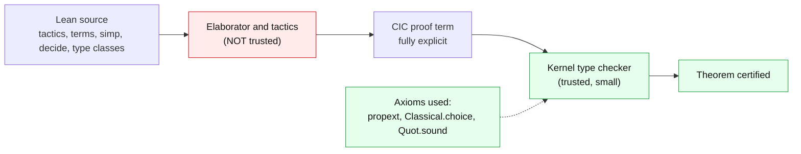

# Verification methodology

> Detailed reference for the [Iwasawa Decomposition and Change of Coordinates](../README.md) project. This page is long and dense with math, so GitHub may show it as source rather than rendering every formula. The short overview, with rendered status, is in the [README](../README.md).

## How the proofs are trusted: formal verification methodology

A formalization is only as trustworthy as the machinery that checks it. This
section records the compiler and proof theoretic principles this project relies on,
what is deliberately kept out of the trusted base, and which standard techniques
were used, omitted, or merely available.

### The de Bruijn criterion and the trusted computing base

Lean 4 satisfies the **de Bruijn criterion**: every proof, however it was produced
(by automation, by tactics, or by hand), is elaborated into a single **proof term**
of the **Calculus of Inductive Constructions** (CIC), and that term is rechecked by
a small, fixed **kernel**. Nothing downstream of the kernel needs to be trusted: not
the tactic framework, not `simp`, not type class search, not the elaborator, not
this README. If any of those produced a bad term, the kernel would reject it.

The **trusted computing base** (TCB) of a Lean development is therefore just:

1. the kernel type checker (a few thousand lines),
2. the logical axioms the development actually invokes, and
3. the hardware and operating system running the checker.



**Propositions as types (Curry, Howard).** In CIC a proposition is a type and a
proof is a term of that type: `h : P` literally means "`h` is a term of type `P`".
Implication is the function type `P → Q`, universal quantification is the dependent
product `∀ x, P x`. Checking a proof is therefore *type checking a term*, which is
decidable and is exactly what the kernel does.

### What `#print axioms` certifies

The command `#print axioms foo` walks the entire dependency tree of `foo` and lists
every `axiom` reaching it. When it prints

```
'foo' depends on axioms: [propext, Classical.choice, Quot.sound]
```

it certifies that `foo` uses **no** `sorry` (which is itself the axiom `sorryAx`),
**no** project specific axiom, and **nothing** beyond the three standard logical
axioms that Mathlib itself is built on. Every named result in this project is checked
this way, and the build output is additionally scanned for the string `sorryAx` to
guarantee no incomplete proof slipped through. This is the operational meaning of
"axiom clean" throughout this README.

The three standard axioms are conservative and well understood:

- **`propext`** (propositional extensionality): logically equivalent propositions are
  equal, $`(P \leftrightarrow Q) \to (P = Q)`$. Standard in classical mathematics.
- **`Classical.choice`**: a nonempty type has a (noncomputable) inhabitant, the type
  theoretic axiom of choice; with `propext` it yields excluded middle. Used for
  nonconstructive existence, for example the Haar measure (`Measure.haar`) and the
  basis `skBasis`.
- **`Quot.sound`**: quotient types respect their defining relation. Needed because
  the reals, measures, and many Mathlib structures are quotients.

These three are exactly the axioms of classical higher order logic with quotients;
they have set theoretic models, so they are consistent and add no unsound
computational content.

### Techniques used (feeding or inside the TCB)

- **Tactic proofs elaborated to terms.** Every proof is written with tactics
  (`rw`, `simp`, `exact`, `refine`, `induction`, `by_contra`), then compiled to an
  explicit CIC term and rechecked. Tactics are convenience, not trust.
- **Definitional equality (`rfl`, defeq).** The kernel identifies terms up to
  computation (beta, delta, iota, eta). The project uses this repeatedly: for example
  `cayleyDerivOnSk X` unfolds definitionally to `-2 • sandwichOnSkCLM (…)`, and
  `consEquiv α ys` is defeq to `Fin.cons ys.1 ys.2` in the Fubini transport.
- **Decidability and `decide`.** A `Decidable` proposition carries an algorithm the
  kernel can run. `card_nnIndex_two : Fintype.card (nnIndex 2) = 1` is closed by
  `decide`, which evaluates the decision procedure *inside the kernel*, keeping the
  result in the TCB (contrast `native_decide`, below).
- **Structural and well founded induction.** Inductive eliminators drive, for
  instance, the induction on the number of variables in `volume_setOf_eval_eq_zero`
  and the induction on `Fin n` in the Gram, Schmidt continuity proof.
- **Type class inference.** Instances such as `MeasurableSpace`, `BorelSpace`,
  `IsHaarMeasure`, `NoAtoms`, and the `Matrix.linftyOp*` normed structures are
  resolved by the elaborator and then checked. Aligning them (reusing the existing
  `MeasurableSpace (Sk n)` rather than introducing an instance diamond) is a real
  part of the engineering.
- **Classical reasoning.** `by_contra`, excluded middle, and noncomputable choice
  are used freely; this is why `Classical.choice` appears in every axiom list.

### Techniques deliberately omitted (kept out of the TCB)

- **`sorry` / `admit`.** Never used. Any occurrence surfaces as `sorryAx` in
  `#print axioms` and is treated as a hard failure.
- **Project axioms.** None. An earlier Haar "bridge" placeholder axiom was found
  redundant and removed; the subtree declares no `axiom`.
- **`native_decide`.** Avoided. It runs a decision procedure as compiled native code
  and trusts the Lean compiler and runtime, which *enlarges* the TCB. We use the
  kernel level `decide`, accepting slower checking for a smaller trusted base.
- **`unsafe`, `partial`, `@[implemented_by]`, `Float`.** None. These bypass the
  termination checker or substitute unverified implementations.

### Techniques useful but not required here

- **Proof by reflection.** Encoding a problem as data and proving a checker correct
  once (as `decide` does in miniature) scales to large finite computations; the
  project's finite checks are small enough that ordinary `decide` suffices.
- **Native compilation / `native_decide`.** Would speed up heavy finite checks at the
  cost of trust; not needed at these sizes.
- **External automation (SMT, resolution hammers).** Lean offers `omega`, `polyrith`,
  and `aesop`, but the genuinely hard steps here (the Cayley determinant, the Mobius
  intertwining, the Fubini null argument) are structural and were written by hand
  against the relevant Mathlib API, not discharged by a hammer.
- **Code extraction.** CIC developments can extract executable programs; this project
  proves theorems about classical objects (Haar measure, manifolds), so there is
  nothing to extract.

The upshot: every theorem in this subtree is a CIC term accepted by the Lean kernel
using only `propext`, `Classical.choice`, and `Quot.sound`. That is the strongest
standard guarantee a Lean formalization can offer.

